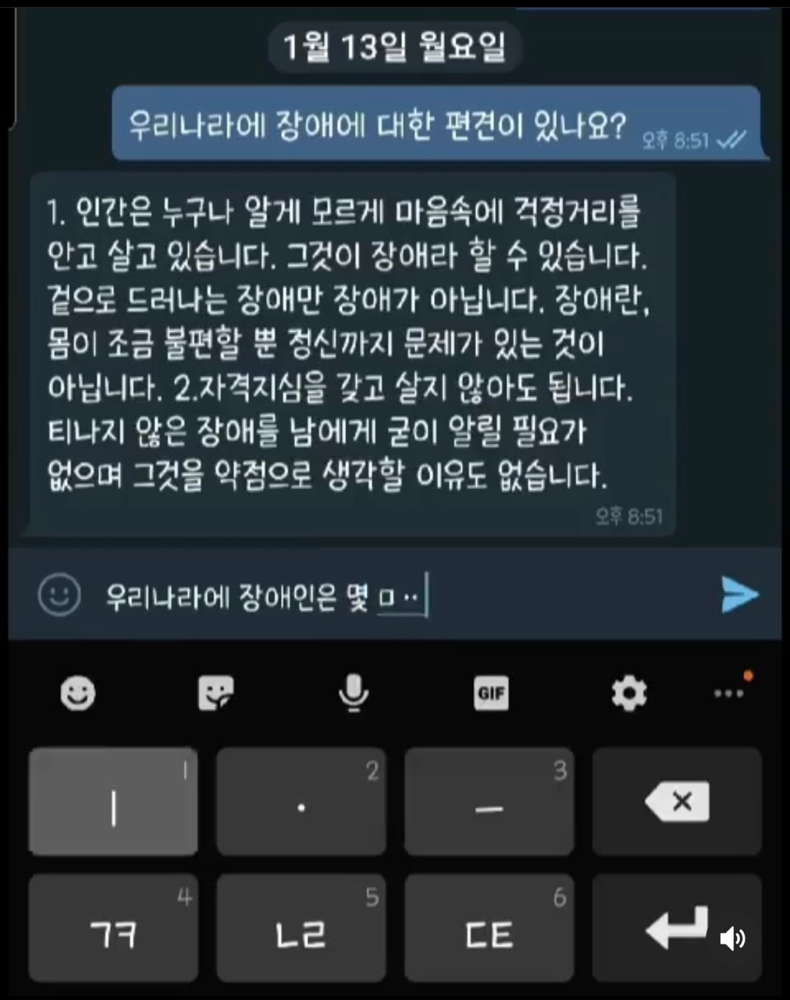

# Tahnsiri
## 장애인 상담챗봇 프로젝트, consultation chatbot for the disabled NLP

- 'Tahnsiri' [제9회 투빅스 컨퍼런스](http://www.datamarket.kr/xe/index.php?mid=board_pdzw77&page=2&document_srl=63534)(2020.01.16)에서 진행한 상담 챗봇 프로젝트입니다.

## Description 📖

- 본 프로젝트에서는 네이버 지식인, 다음 등 검색창의 데이터를 직접 수집하여, 장애인 상담 질문에 대한 답변 챗봇을 구현하였습니다.

1. **[Model]** 

## Result (Mobile) 

- 챗봇에 주요 질문을 검색한 결과 화면

👨🏻‍🏫 시연 화면&nbsp;&nbsp;&nbsp;&nbsp;&nbsp;&nbsp;&nbsp;&nbsp;  🎬 시연 영상   
 

## Presentation 🙋

컨퍼런스 발표 자료입니다.   
[제9회 투빅스 컨퍼런스](http://www.datamarket.kr/xe/index.php?mid=board_pdzw77&page=2&document_srl=63534)

## Contributor 🧑‍🤝‍🧑

- 본 프로젝트에는 [빅데이터 분석 및 인공지능 대표 연합동아리 ToBig's](http://www.datamarket.kr/xe/) 멤버들이 참여하였습니다.

|기수|이름|
|:-----:|:-----:|
|10기|이준걸|
|10기|임진혁|
|11기|권혜민|
|12기|김효은|
|12기|배유나|
|12기|신윤종|
|12기|이유진|

## File Directory 📂

```shell
Tahnsiri
├── 1. crawler
│
├── 2. Data
│
├── 3. Model
│
├── 4. Model opt
│
├── 5. Presentation
│
└── 6. Masterpiece
      
```
